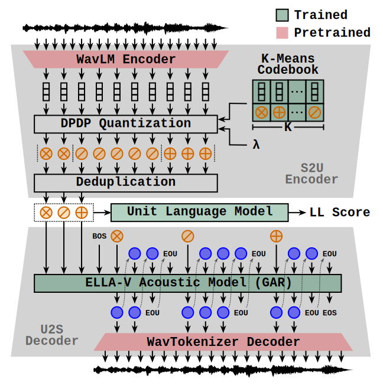
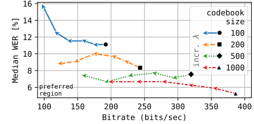

# DP-SLM

Official repository for [Spoken Language Modeling with Duration-Penalized Self-Supervised Units](https://arxiv.org/abs/2505.23494).



Each component in the system can be found in one of the following repositories:

- [WavLM Encoder](https://github.com/nicolvisser/WavLM-codebooks)
- [DPDP Quantizer](https://github.com/nicolvisser/dpdp) or [DP-WFST Quantizer](https://github.com/nicolvisser/dp-wfst)
- [Unit Language Model](https://github.com/nicolvisser/Mistral-ULM)
- [ELLA-V Acoustic Model](https://github.com/nicolvisser/ELLA-V)
- [WavTokenizer Decoder](https://github.com/nicolvisser/WavTokenizer)

## Usage

First install all the requirements:

```sh
pip install torch torchvision torchaudio soundfile xformers simple-parsing requests tqdm
```

Load your waveform:
```py
import torch
import torchaudio

wav, sr = torchaudio.load("your_audio.wav")
```

Pick a $K$ and $\lambda$ value from the paper:
```py
k = 500
lmbda = 4500
```
- `k` is the codebook size.
- `lmbda` controls the coarseness of the the units.
  - Higher values will result in shorter sequence lengths of the resulting units.

Encode features:

```py
wavlm, extract_features = torch.hub.load(
    "nicolvisser/WavLM-codebooks",
    "wavlm_large",
    trust_repo=True,
)
wavlm.to("cuda")

with torch.inference_mode():
    features = extract_features(wavlm, wav, sr, layer=11)
```

Quantize to a $K$-means codebook with DPDP:

```py
codebook = torch.hub.load(
    "nicolvisser/WavLM-codebooks",
    "codebook",
    layer=11,
    k=k,
    trust_repo=True,
)
quantizer = torch.hub.load(
    "nicolvisser/dpdp",
    "dpdp_quantizer_from_codebook",
    codebook=codebook,
    lmbda=lmbda,
    num_neighbors=int(0.05*k),
    trust_repo=True
)
quantizer.to("cuda")

with torch.inference_mode():
    quantized_features, units_duped = quantizer(features)
```

Deduplicate the units:
```py
units_deduped = torch.unique_consecutive(units_duped)
```

Compute the log-likelihood under the LM:

```py
ulm, ulm_tokenizer = torch.hub.load(
    "nicolvisser/Mistral-ULM",
    "ulm_wavlm_layer_11_dpdp_hours_1k_steps_10k",
    k=k,
    lmbda=lmbda,
    trust_repo=True,
    force_reload=True,
)
ulm.to("cuda")

with torch.inference_mode():
    ulm_input = ulm_tokenizer.encode(units_deduped.tolist()).cuda()
    ulm_ll = ulm.loglikelihood(ulm_input)
```

Generate acoustic codes from the deduped units:

```py
ellav = torch.hub.load(
    "nicolvisser/ELLA-V",
    "ellav_units_to_wavtokenizer",
    k=k,
    lmbda=lmbda,
    trust_repo=True
)
ellav.to("cuda")

with torch.inference_mode():
    prompt = [f"u{unit}" for unit in units_deduped.tolist()]
    codec_ids_list, finished = ellav.generate(
        prompts=[prompt] * 3, # generate 3 examples
        max_tokens=1000,
        max_codec_tokens_per_phone=10,
        temperature=1.0,
        top_p=0.8,
    )
```

Vocode to waveforms:

```py
wavtokenizer, _, vocode = torch.hub.load(
    "nicolvisser/WavTokenizer",
    "small_600_24k_4096",
    trust_repo=True,
    force_reload=True
)
wavtokenizer.to("cuda")

with torch.inference_mode():
    for i, codec_ids in enumerate(codec_ids_list):
        wav_, sr_ = vocode(wavtokenizer, codec_ids[None, None, :])
        torchaudio.save(f"resynth_{i}.wav", wav_.cpu(), sr_)
```

You can change the values of `k` and `lmbda` but they must be one of the following combinations (for which we have trained the downstream models):

```py
 valid_combinations = [
    # (k, lmbda)
    (100, 0),
    (100, 600),
    (100, 1500),
    (100, 3000),
    (100, 5000),
    (100, 9000),

    (200, 0),
    (200, 700),
    (200, 1500),
    (200, 3000),
    (200, 5000),
    (200, 7500),

    (500, 0),
    (500, 600),
    (500, 1500),
    (500, 2800),
    (500, 4500),
    (500, 7000),

    (1000, 0),
    (1000, 600),
    (1000, 1400),
    (1000, 2500),
    (1000, 3800),
    (1000, 6000),
]

```
You will find that there are many mispronunciations in the resynthesized output when the codebook size (`k`) is small and using coarser units (`lmbda > 0`). However, as the codebook size increases, we can push the coarseness (`lmbda`) quite far without introducing significant mispronunciations. This is evaluated in Figure 4* of the paper:



\* For this figure, we used greedy sampling during acoustic modelling, i.e., `ellav.generate(..., temperature=1.0, top_p=0.0)`

You can listen to these samples [here](https://dp-slm.netlify.app/).

# Citation

If you found our work helpful, please consider citing our paper:

```
@inproceedings{
    dpslm2025,
    title={Spoken Language Modeling with Duration-Penalized Self-Supervised Units}, 
    author={Visser, Nicol and Kamper, Herman},
    booktitle={Proc. Interspeech}, 
    year={2025}
}
```
