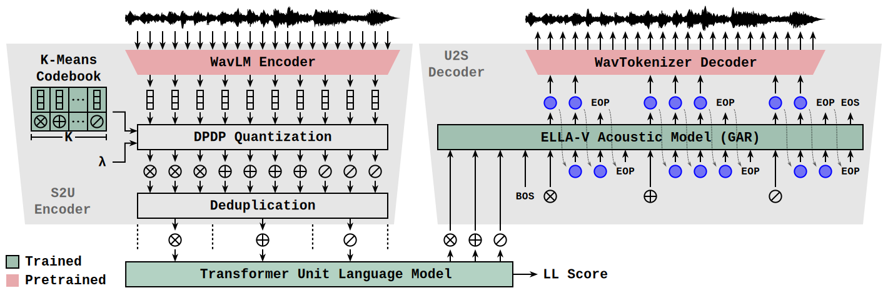

# DP-SLM

A pipeline for spoken language modeling using duration-penalized discrete units.

## The pipeline



## Installation

The `k2` FST library is required to run the optimized DPDP Quantization algorithm. `k2` is not that easy to install with CUDA support. I think `poetry` is the 2nd best way to manage dependencies when using `k2` in your project. The best would be to use `docker`. Below are the instructions to install the dependencies using `poetry`.

### Clone the repository

```
git clone https://github.com/nicolvisser/dp-slm.git
cd dp-slm
```

### Install CUDA toolkit

On Ubuntu:
```
sudo apt update
sudo apt-get install nvidia-cuda-toolkit pipx
```

### Install poetry

Follow the instructions on https://python-poetry.org/docs/#installation

On Ubuntu:
```
sudo apt install pipx
pipx ensurepath
pipx install poetry
```

### Install requirements into a virtual environment

```
poetry install
```

### Activate the virtual environment

```
poetry shell
```

## Sample usage

```py
import torch
import torchaudio

pipeline = torch.hub.load(
    "nicolvisser/dp-slm",
    "dpslm",
    K=100,
    lmbda=0,
)
pipeline.eval()

wav, sr = torchaudio.load("sample.flac")
wav = wav.cuda()

units = pipeline.encode_units(wav)
wav, sr = pipeline.generate_audio(
    units,
    top_p=0.8,
    temperature=1.0,
    max_phoneme_duration=0.4,
    show_progress=True,
)

torchaudio.save("resynthesized_sample.wav", wav.cpu(), sr)
```

## Available models

| Layer | K    | λ    | bitrate (bps) |
| ----- | ---- | ---- | ------------- |
| 11    | 100  | 0    | 192           |
|       |      | 600  | 177           |
|       |      | 1500 | 159           |
|       |      | 3000 | 138           |
|       |      | 5000 | 118           |
|       |      | 9000 | 99            |
|       | 200  | 0    | 243           |
|       |      | 700  | 223           |
|       |      | 1500 | 204           |
|       |      | 3000 | 175           |
|       |      | 5000 | 147           |
|       |      | 7500 | 124           |
|       | 500  | 0    | 320           |
|       |      | 600  | 295           |
|       |      | 1500 | 265           |
|       |      | 2800 | 229           |
|       |      | 4500 | 194           |
|       |      | 7000 | 160           |
|       | 1000 | 0    | 386           |
|       |      | 600  | 356           |
|       |      | 1400 | 320           |
|       |      | 2500 | 279           |
|       |      | 3800 | 242           |
|       |      | 6000 | 200           |


